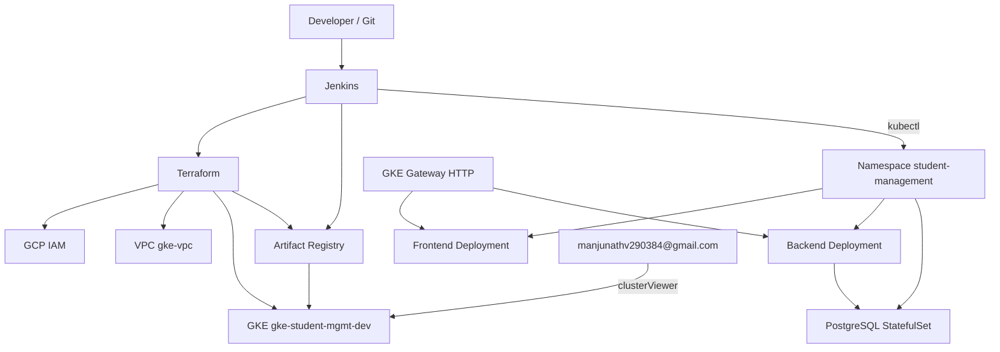

# Student Management System

Full-stack student CRUD application (Spring Boot, React, PostgreSQL) with **localhost** development and a **Google Cloud / GKE** deployment path.

| Item | Value |
|------|--------|
| GCP project | `gcp-dev-july-2026` |
| Region | `us-central1` |
| Validated GKE cluster | `gke-student-mgmt-dev` |
| Human operator (local `gcloud` / `kubectl`) | `manjunathv290384@gmail.com` |
| Infrastructure service account (Terraform / Jenkins) | `infra-admin@gcp-dev-july-2026.iam.gserviceaccount.com` |
| Current Git branch | `feature/student-management-gke-infrastructure` |
| GitHub | https://github.com/manjunath031984/Student-Management |

Local Docker still does **not** use Docker Compose. Terraform manages GCP infrastructure only. Jenkins applies Kubernetes manifests with `kubectl`. Additional Terraform notes live in [`terraform/README.md`](terraform/README.md).

## Table of contents

- [Project status](#project-status)
- [End-to-end architecture](#end-to-end-architecture)
- [Stage 1 — Repository setup](#stage-1--repository-setup)
- [Stage 2 — Terraform infrastructure](#stage-2--terraform-infrastructure)
- [Stage 3 — GCP IAM](#stage-3--gcp-iam)
- [Stage 4 — GCP networking](#stage-4--gcp-networking)
- [Stage 5 — Artifact Registry](#stage-5--artifact-registry)
- [Stage 6 — Application Dockerization](#stage-6--application-dockerization)
- [Stage 7 — GKE cluster](#stage-7--gke-cluster)
- [Stage 8 — GKE IAM / cluster access](#stage-8--gke-iam--cluster-access)
- [Stage 9 — GKE authentication plugin](#stage-9--gke-authentication-plugin)
- [Stage 10 — Kubernetes validation](#stage-10--kubernetes-validation)
- [Stage 11 — Kubernetes application deployment](#stage-11--kubernetes-application-deployment)
- [Stage 12 — Application validation](#stage-12--application-validation)
- [Stage 13 — Jenkins / CI-CD](#stage-13--jenkins--ci-cd)
- [Stage 14 — Architecture diagram](#stage-14--architecture-diagram)
- [Stage 15 — Deployment flow](#stage-15--deployment-flow)
- [Stage 16 — Command reference](#stage-16--command-reference)
- [Stage 17 — Troubleshooting](#stage-17--troubleshooting)
- [Completed vs future work](#completed-vs-future-work)
- [Local Windows development](#3-features) (original localhost guide, below)

---

## Project status

Statuses below are from this repository plus **observed** `kubectl` output on `gke-student-mgmt-dev`. QA/PROD Terraform files exist; they were **not** the validated live cluster.

| Stage | Status | Details |
|-------|--------|---------|
| Git repository | Completed | GitHub remote; work on `feature/student-management-gke-infrastructure` |
| Terraform (GCP infra) | Completed | Modules under `terraform/`; GCS backend; Jenkins apply |
| IAM | Completed | `infra-admin` project roles + human `roles/container.clusterViewer` |
| Networking | Completed | VPC, GKE subnet, secondary ranges, proxy-only subnet, firewall (no Cloud NAT/router in this repo) |
| Artifact Registry | Completed | Docker repo `student-management` in `us-central1` |
| Docker images | Completed | `backend/Dockerfile`, `frontend/Dockerfile`; Jenkins `buildx` push |
| GKE | Completed / validated | Regional Standard cluster `gke-student-mgmt-dev` |
| Kubernetes workloads | Completed / validated | Namespace `student-management`; frontend, backend, PostgreSQL `1/1 Running` |
| Jenkins pipeline | Completed in repo | Root `Jenkinsfile` + `jenkins/Dockerfile` |
| Local Windows app | Completed | Spring Boot + React + PostgreSQL 18; Docker without Compose |
| HTTPS / TLS on Gateway | Planned | HTTP listener port 80 only |
| Dedicated GKE node SA | Not current | Workers use `infra-admin` (see IAM module) |
| Cloud NAT / Cloud Router | Not implemented | Not present in `terraform/modules/network` |

---

## End-to-end architecture

```text
Git Repository
      |
      v
Jenkins (Jenkinsfile)
      |
      +-- terraform apply --> GCP IAM, VPC, GKE, Artifact Registry
      |
      +-- docker buildx --push --> Artifact Registry
      |
      +-- kubectl apply --> student-management namespace
                              |
                 +------------+------------+
                 |            |            |
                 v            v            v
              Frontend     Backend     PostgreSQL
              Deployment   Deployment  StatefulSet
```

Local operator access (not Jenkins):

```text
manjunathv290384@gmail.com
        |
        +-- roles/container.clusterViewer
        |
        +-- gcloud / kubectl on the workstation
```

---

## Stage 1 — Repository setup

### Git

- Remote: `https://github.com/manjunath031984/Student-Management`
- Default branch: `main`
- Application feature branch (localhost work): `feature/Student-Management`
- Infrastructure / GKE feature branch (current): `feature/student-management-gke-infrastructure`

Do not push application or infrastructure work directly to `main` unless explicitly requested.

### Layout (actual)

```text
Student-Management/
├── backend/                 # Spring Boot 3.2.x, Java 17, port 8080
├── frontend/                # React/Vite, Nginx port 80
├── terraform/               # GCP infrastructure (no Kubernetes provider)
│   ├── main.tf              # Module wiring
│   ├── variables.tf
│   ├── outputs.tf
│   ├── providers.tf
│   ├── versions.tf
│   ├── backend.tf           # GCS backend (empty config; file per env)
│   ├── locals.tf
│   ├── backend/             # gke/dev, gke/qa, gke/prod prefixes
│   ├── environments/        # dev.tfvars, qa.tfvars, prod.tfvars
│   ├── bootstrap/           # State bucket (once)
│   ├── kubernetes/          # Manifests applied by Jenkins/kubectl
│   └── modules/
│       ├── project-services/
│       ├── iam/
│       ├── network/
│       ├── firewall/
│       ├── artifact-registry/
│       └── gke/
├── jenkins/Dockerfile       # Custom Jenkins image (Java 17, Maven 3.5.4, Terraform, gcloud, kubectl)
├── Jenkinsfile              # Pipeline
├── setup.ps1                # Local tool checks (does not install software)
└── README.md
```

| Path | Purpose |
|------|---------|
| `backend/` | REST API (`/api/students`) |
| `frontend/` | React UI |
| `terraform/modules/*` | GCP resources |
| `terraform/kubernetes/` | Namespace, Deployments, StatefulSet, Services, Gateway API |
| `Jenkinsfile` | Plan/apply, image push, `kubectl` deploy, destroy |

---

## Stage 2 — Terraform infrastructure

Terraform **does not** apply application manifests. There is no Kubernetes provider. Workloads are deployed by Jenkins with `kubectl`.

### Versions and provider

- Terraform: `>= 1.13.0, < 2.0.0` (`terraform/versions.tf`); Jenkins default `1.13.5`
- Provider: `hashicorp/google` `~> 6.0`
- Provider project/region: `var.project_id` / `var.region` (`terraform/providers.tf`)

### Remote state

Implemented. `terraform/backend.tf` uses `backend "gcs" {}`. Per-environment files:

| Environment | Bucket | Prefix | Cluster name in tfvars |
|-------------|--------|--------|------------------------|
| DEV | `gcp-dev-july-2026-terraform-state` | `gke/dev` | `gke-student-mgmt-dev` |
| QA | same bucket | `gke/qa` | `gke-student-mgmt-qa` |
| PROD | same bucket | `gke/prod` | `gke-student-mgmt-prod` |

Bucket creation: `terraform/bootstrap` (uniform access, public access prevention enforced, versioning). Jenkins can also create the bucket before `terraform init` if it is missing.

### Modules and dependency order

From `terraform/main.tf`:

1. `project-services` — enable APIs (`disable_on_destroy = false`)
2. `iam` — depends on project-services
3. `network` — depends on project-services
4. `firewall` — depends on network
5. `artifact-registry` — depends on project-services and iam
6. `gke` — depends on project-services, network, iam, firewall

APIs enabled: `container`, `compute`, `iam`, `iamcredentials`, `cloudresourcemanager`, `artifactregistry`, `logging`, `monitoring`.

### Commands (this project)

From `terraform/` with the matching backend file and tfvars (example: **dev**):

```bash
cd terraform
terraform fmt -recursive          # Format HCL
terraform init -reconfigure -backend-config=backend/dev.tfbackend
terraform validate                # Syntax and module graph
terraform plan -var-file=environments/dev.tfvars
terraform apply -var-file=environments/dev.tfvars
```

`terraform destroy` is **destructive**. Jenkins exposes `ACTION=DESTROY` with a manual approval. It does not destroy the bootstrap GCS bucket.

Selected outputs (`terraform/outputs.tf`): `project_id`, network/subnet CIDRs, cluster name/region/zones, node pool, Artifact Registry id/location. Cluster endpoint and CA cert are sensitive module outputs.

---

## Stage 3 — GCP IAM

Identities are **not** interchangeable.

```text
Human User (manjunathv290384@gmail.com)
    |
    +-- roles/container.clusterViewer
    |
    +-- Local gcloud / kubectl


infra-admin (infra-admin@gcp-dev-july-2026.iam.gserviceaccount.com)
    |
    +-- Terraform / Jenkins
    |
    +-- Infrastructure administration (and GKE node identity)
```

### Human operator

Terraform resource: `google_project_iam_member.gke_cluster_viewer` in `terraform/modules/iam/main.tf`.

- Principal: `user:manjunathv290384@gmail.com`
- Role: `roles/container.clusterViewer` (includes `container.clusters.get`)
- Purpose: local `gcloud container clusters describe` / `get-credentials`

The human user does **not** receive `roles/container.admin`. Cluster administration and Jenkins apply use `infra-admin`. Cluster Viewer is enough to **read** cluster metadata and obtain kubeconfig; it is not cluster-admin on GCP.

If the allow policy lists Cluster Viewer but APIs still return 403, accept the Cloud Console project invitation as that Gmail account and refresh `gcloud auth login`. Do not switch local `gcloud` to the service account.

### Infrastructure service account

Existing account (data source, not created by this module): `infra-admin@gcp-dev-july-2026.iam.gserviceaccount.com`.

Roles actually granted in `terraform/modules/iam/main.tf` (Owner/Editor are **not** granted):

| Role |
|------|
| `roles/container.admin` |
| `roles/compute.networkAdmin` |
| `roles/compute.securityAdmin` |
| `roles/artifactregistry.admin` |
| `roles/iam.serviceAccountUser` |
| `roles/iam.serviceAccountAdmin` |
| `roles/serviceusage.serviceUsageAdmin` |
| `roles/logging.configWriter` |
| `roles/logging.logWriter` |
| `roles/monitoring.editor` |
| `roles/stackdriver.resourceMetadata.writer` |
| `roles/storage.objectAdmin` |
| `roles/storage.admin` |

GKE nodes use this same account (`node_service_account_email = module.iam.infra_admin_email` in `terraform/main.tf`). `roles/container.defaultNodeServiceAccount` is **not** in the Terraform IAM list.

`infra-admin` is also granted `roles/artifactregistry.reader` on the Docker repository (`terraform/main.tf` `reader_members`).

IAM resources are additive `google_project_iam_member` only. This repo does not use `google_project_iam_policy` or `google_project_iam_binding`.

---

## Stage 4 — GCP networking

Module: `terraform/modules/network` and `terraform/modules/firewall`. Values below are from `terraform/environments/dev.tfvars` (validated environment).

| Component | What | Why | Module |
|-----------|------|-----|--------|
| VPC `gke-vpc` | Custom VPC, `auto_create_subnetworks = false`, regional routing | Isolate GKE | `network` |
| Subnet `gke-subnet` | `192.168.0.0/24`, `us-central1`, **Private Google Access** on | Nodes, VPC-native GKE | `network` |
| Secondary range `gke-pods` | `192.168.16.0/20` | Pod IPs | `network` |
| Secondary range `gke-services` | `192.168.32.0/20` | Service IPs | `network` |
| Proxy-only subnet `gke-proxy-only` | `192.168.48.0/23`, purpose `REGIONAL_MANAGED_PROXY` | GKE Gateway regional external Application Load Balancer | `network` |
| Firewall `gke-student-mgmt-allow-ssh` | TCP/22, source `ssh_source_ranges` (dev: `0.0.0.0/0`), tag `gke-student-mgmt-ssh` | Direct SSH; IAP is not configured | `firewall` |
| Firewall `gke-student-mgmt-allow-health-checks` | TCP 80 and 8080 from `130.211.0.0/22` and `35.191.0.0/16`, tag `gke-student-mgmt-web` | GCP/GKE health checks | `firewall` |

**Not in this repository:** Cloud NAT, Cloud Router, custom routes beyond VPC defaults, a public PostgreSQL firewall rule (5432 stays ClusterIP).

GKE networking mode: `VPC_NATIVE` with those secondary ranges (`terraform/modules/gke/main.tf`). Nodes are **not** private-node (no `private_cluster_config` block). Workers receive public IPs and both SSH and web tags.

---

## Stage 5 — Artifact Registry

Module: `terraform/modules/artifact-registry`.

| Setting | Value |
|---------|--------|
| Project | `gcp-dev-july-2026` |
| Location | `us-central1` |
| Repository ID | `student-management` |
| Format | `DOCKER` |

Images (Jenkins never uses `latest`; tag is `IMAGE_TAG` or `BUILD_NUMBER`):

```text
us-central1-docker.pkg.dev/gcp-dev-july-2026/student-management/student-management-backend:${IMAGE_TAG}
us-central1-docker.pkg.dev/gcp-dev-july-2026/student-management/student-management-frontend:${IMAGE_TAG}
```

Pipeline (from `Jenkinsfile`):

```bash
gcloud auth configure-docker us-central1-docker.pkg.dev --quiet
docker buildx build --push -f backend/Dockerfile \
  -t us-central1-docker.pkg.dev/gcp-dev-july-2026/student-management/student-management-backend:${IMAGE_TAG} \
  backend
docker buildx build --push --build-arg VITE_API_BASE_URL=/api -f frontend/Dockerfile \
  -t us-central1-docker.pkg.dev/gcp-dev-july-2026/student-management/student-management-frontend:${IMAGE_TAG} \
  frontend
```

GKE pulls those images. Node identity is `infra-admin`, which has Artifact Registry admin at project level plus repository **reader** on this repo.

---

## Stage 6 — Application Dockerization

```text
Application source
       |
       v
Dockerfile (multi-stage)
       |
       v
Image tagged for Artifact Registry
       |
       v
GKE Deployments (imagePullPolicy IfNotPresent)
```

### Backend (`backend/Dockerfile`)

- Build: `eclipse-temurin:17-jdk-jammy`, Maven **3.5.4**, `mvn -B clean package -DskipTests`
- Runtime: `eclipse-temurin:17-jre-jammy`, JAR `student-management-1.0.0.jar`
- Port: `8080`
- GKE env: `DB_HOST`, `DB_PORT`, `DB_NAME`, `DB_USERNAME` from ConfigMap; `DB_PASSWORD` from Secret

### Frontend (`frontend/Dockerfile`)

- Build: `node:22-alpine`, `npm ci`, `npm run build`
- Build-arg/env: `VITE_API_BASE_URL=/api` (GKE same-origin `/api` via HTTPRoute)
- Runtime: `nginx:1.27-alpine`, port `80`
- Local `npm run dev` still defaults Axios to `http://localhost:8080/api` when the env is unset (`frontend/src/services/studentService.js`)

This project has **no** `docker-compose.yml`. Local Docker runs are independent containers; GKE does not use Compose.

---

## Stage 7 — GKE cluster

Validated cluster (dev tfvars + live `kubectl`):

| Setting | Implemented value |
|---------|-------------------|
| Name | `gke-student-mgmt-dev` |
| Project | `gcp-dev-july-2026` |
| Location | Regional `us-central1` |
| Type | Standard (not Autopilot) |
| Node locations | `us-central1-a`, `us-central1-b` |
| Node pool | `gke-student-mgmt-dev-workers` (default pool removed) |
| Total nodes | `node_count = 2` → **1 per zone** |
| Autoscaling | Not configured (fixed `node_count`) |
| Machine type (dev) | `e2-standard-2` |
| Disk | `50` GB `pd-balanced` |
| Image type | `UBUNTU_CONTAINERD` |
| Release channel (dev) | `REGULAR` |
| Networking | `VPC_NATIVE` |
| Workload Identity | Enabled (`workload_pool = gcp-dev-july-2026.svc.id.goog`, `GKE_METADATA`) |
| Private cluster | Not configured |
| HTTP load balancing addon | Enabled |
| Horizontal pod autoscaling addon | **Disabled** |
| Network policy addon | **Disabled** |
| Gateway API | `CHANNEL_STANDARD` |
| Logging | `SYSTEM_COMPONENTS`, `WORKLOADS` |
| Monitoring | `SYSTEM_COMPONENTS` |
| Shielded nodes | Secure boot + integrity monitoring |
| Legacy metadata | Disabled |
| Deletion protection (dev) | `false` |
| Observed Kubernetes version | `v1.35.6-gke.1641000` (from `kubectl get nodes`; not pinned in Terraform) |

PROD tfvars differ (for example `e2-standard-4`, `100` GB disk, `STABLE` channel, `deletion_protection = true`, cluster name `gke-student-mgmt-prod`). Those files are in the repo; they are not the validated live cluster in Stage 10.

---

## Stage 8 — GKE IAM / cluster access

Use the **human user**, not `infra-admin`:

```bash
gcloud auth login manjunathv290384@gmail.com
gcloud config set project gcp-dev-july-2026
```

Confirm identity, then **GCP IAM** (`container.clusters.get`) before kubeconfig:

```bash
gcloud auth list
gcloud config get-value account
gcloud config get-value project

gcloud container clusters describe gke-student-mgmt-dev \
  --region us-central1 \
  --project gcp-dev-july-2026
```

Then GKE authentication into kubeconfig:

```bash
gcloud container clusters get-credentials gke-student-mgmt-dev \
  --region us-central1 \
  --project gcp-dev-july-2026
```

`roles/container.clusterViewer` is the intended GCP role for this operator. Do not activate the Jenkins service account for this workstation flow.

---

## Stage 9 — GKE authentication plugin

`kubectl` against GKE requires **gke-gcloud-auth-plugin**. If it is missing, the client reports that the plugin was not found or is not executable.

On the operator workstation (Google Cloud SDK):

```bash
gcloud components install gke-gcloud-auth-plugin
gke-gcloud-auth-plugin --version
```

Current Cloud SDK enables the plugin for GKE once it is installed. The Jenkins image already installs `google-cloud-cli-gke-gcloud-auth-plugin` (`jenkins/Dockerfile`).

---

## Stage 10 — Kubernetes validation

Observed on the validated cluster (do not alter these names or lines).

### Nodes

```bash
kubectl get nodes
```

```text
NAME                                                  STATUS   ROLES    AGE   VERSION
gke-gke-student-mgmt-gke-student-mgmt-aec0808f-gdnz   Ready    <none>   16h   v1.35.6-gke.1641000
gke-gke-student-mgmt-gke-student-mgmt-fd891442-kttj   Ready    <none>   16h   v1.35.6-gke.1641000
```

Both workers were **Ready**.

### Default namespace

```bash
kubectl get pods
```

```text
No resources found in default namespace.
```

Application pods are not in `default`.

### Namespaces

```bash
kubectl get ns
```

```text
default
gke-managed-networking-dra-driver
gke-managed-system
gke-managed-volumepopulator
gmp-public
gmp-system
kube-node-lease
kube-public
kube-system
student-management
```

### Namespace `student-management`

```bash
kubectl get pods -n student-management
```

```text
NAME                            READY   STATUS    RESTARTS   AGE
backend-bd777c64f-jth4z         1/1     Running   0          16h
frontend-564dcf95f7-j8z8c       1/1     Running   0          16h
student-management-postgres-0   1/1     Running   0          16h
```

Backend, frontend, and PostgreSQL were all **1/1 Running**.

---

## Stage 11 — Kubernetes application deployment

Manifests: `terraform/kubernetes/`. Jenkins applies them after image push (placeholder tags replaced with `${IMAGE_TAG}`).

```text
                    GKE Cluster (gke-student-mgmt-dev)
                         |
                         v
              student-management namespace
                         |
          +--------------+--------------+
          |              |              |
          v              v              v
      Frontend        Backend       PostgreSQL
      Deployment      Deployment    StatefulSet
      replicas: 1     replicas: 1   replicas: 1
          |              |              |
          v              v              v
      Service :80     Service :8080  Service :5432
      ClusterIP       ClusterIP      ClusterIP
                         |
                         +-- JDBC --> postgres:5432
Internet --> Gateway (gke-l7-regional-external-managed)
                         |
              HTTPRoute /api --> backend-service:8080
              HTTPRoute /    --> frontend-service:80
```

| Resource | Name | Notes |
|----------|------|--------|
| Namespace | `student-management` | |
| Deployment | `frontend` | Container port 80; HTTP probes `/`; image Artifact Registry frontend |
| Deployment | `backend` | Container port 8080; TCP probes; DB env from ConfigMap + Secret |
| StatefulSet | `student-management-postgres` | Image `postgres:18`; `pg_isready`; PVC mount |
| PVC | `student-management-postgres-pvc` | `10Gi`, `ReadWriteOnce`, `standard-rwo` |
| ConfigMap | `student-management-config` | `DB_HOST=student-management-postgres`, port `5432`, DB `student_management`, user `student_admin` |
| Secret | `student-management-postgres-secret` | DB name/user/password; Jenkins creates if missing (password not committed) |
| Secret | `student-management-backend-secret` | `DB_PASSWORD` copied from Postgres secret |
| Services | `frontend-service`, `backend-service`, `student-management-postgres` | All ClusterIP |
| Gateway | `student-management-gateway` | HTTP 80 |
| HTTPRoute | `student-management-route` | `/api` and `/` |
| HealthCheckPolicy | `frontend-healthcheck`, `backend-healthcheck` | HTTP `/` on 80; TCP 8080 |

GatewayClass `gke-l7-regional-external-managed` is GKE-managed; Jenkins applies the local YAML only if the class is absent.

---

## Stage 12 — Application validation

| Command | What it checks |
|---------|----------------|
| `kubectl get nodes` | Workers Ready (GCP + kubelet) |
| `kubectl get pods` | Default namespace (expected empty for this app) |
| `kubectl get ns` | `student-management` exists |
| `kubectl get pods -n student-management` | Frontend, backend, Postgres Running |

Jenkins **Deployment Verification** also checks exactly two nodes, ClusterIP services, Gateway address, and HTTP 200 on `http://<GATEWAY-IP>/` and `http://<GATEWAY-IP>/api/students`.

```bash
kubectl get nodes
kubectl get pods
kubectl get ns
kubectl get pods -n student-management
kubectl get gateway,httproute,svc -n student-management
```

---

## Stage 13 — Jenkins / CI-CD

Implemented in the repository (not a placeholder).

| Item | Actual |
|------|--------|
| Pipeline | Root `Jenkinsfile` |
| Controller image | `jenkins/Dockerfile` (`jenkins/jenkins:lts-jdk17`, Maven 3.5.4, Terraform 1.13.5, Docker CLI, gcloud + GKE auth plugin, kubectl, Node 22) |
| GCP credential | Jenkins **secret file** ID `gcp-infra-admin` → `GOOGLE_APPLICATION_CREDENTIALS` (JSON is not in git) |
| Parameters | `ACTION` = `APPLY` or `DESTROY`; `ENVIRONMENT` = `dev` / `qa` / `prod`; `IMAGE_TAG`; `TERRAFORM_VERSION`; `GCP_PROJECT_ID`; `GCP_REGION` |

### APPLY stages (order)

1. **Checkout Source** — cluster name `gke-student-mgmt-${ENVIRONMENT}`
2. **Build & Test** — `mvn` test/package; frontend `npm ci`, lint, build
3. **Terraform Plan** — state bucket ensure; `terraform init/validate/plan`
4. **Approve Terraform Apply** — manual `input`
5. **Terraform Apply**
6. **Docker Build & Push** — Artifact Registry
7. **Deploy Application** — `get-credentials` as `infra-admin`; `kubectl apply` manifests
8. **Deployment Verification**

### DESTROY stages

9. **Approve Terraform Destroy**
10. **Terraform Destroy** — Gateway/HTTPRoute cleanup then `terraform apply -destroy`

PostgreSQL password: if the secret does not exist, Jenkins generates one with `/dev/urandom` and does not commit it.

---

## Stage 14 — Architecture diagram



---

## Stage 15 — Deployment flow

```text
Git Repository
      |
      v
Terraform (Jenkins APPLY)
      |
      +--------------------+
      |                    |
      v                    v
GCP IAM                GCP Network
                           |
                           v
                    Artifact Registry
                           |
                           v
                         GKE
                           |
                           v
                    Kubernetes
                           |
              +------------+------------+
              |            |            |
              v            v            v
           Frontend     Backend     PostgreSQL
```

---

## Stage 16 — Command reference

### Terraform (dev)

```bash
cd terraform
terraform init -reconfigure -backend-config=backend/dev.tfbackend
terraform fmt -recursive
terraform validate
terraform plan -var-file=environments/dev.tfvars
terraform apply -var-file=environments/dev.tfvars
# Destructive:
# terraform plan -destroy -var-file=environments/dev.tfvars
# terraform apply -destroy -var-file=environments/dev.tfvars
```

### GCP authentication (human user)

```bash
gcloud auth login manjunathv290384@gmail.com
gcloud auth list
gcloud config get-value account
gcloud config get-value project
gcloud config set project gcp-dev-july-2026
```

### GKE

```bash
gcloud container clusters describe gke-student-mgmt-dev \
  --region us-central1 \
  --project gcp-dev-july-2026

gcloud container clusters get-credentials gke-student-mgmt-dev \
  --region us-central1 \
  --project gcp-dev-july-2026
```

### Kubernetes

```bash
kubectl config current-context
kubectl get nodes
kubectl get pods
kubectl get ns
kubectl get pods -n student-management
```

---

## Stage 17 — Troubleshooting

### Issue 1 — `container.clusters.get` 403

```text
Required "container.clusters.get" permission(s)
```

Authenticated as `manjunathv290384@gmail.com`. Required GCP role: `roles/container.clusterViewer` (Terraform `gke_cluster_viewer`). Confirm the binding as an **administrator** (`gcloud projects get-iam-policy`); the Gmail user typically cannot `getIamPolicy` with only Cluster Viewer. Do **not** switch local `gcloud` to `infra-admin`. If the binding exists but APIs still 403, accept the Cloud Console invite for that Gmail account and run `gcloud auth login` again. Independent test: `gcloud container clusters describe` (still GCP IAM, not Kubernetes RBAC).

### Issue 2 — `gke-gcloud-auth-plugin`

```text
gke-gcloud-auth-plugin ... was not found or is not executable
```

Install the plugin with `gcloud components install gke-gcloud-auth-plugin` and confirm `gke-gcloud-auth-plugin --version`. This is a **local client** requirement after kubeconfig exists.

### Issue 3 — `kubectl get pods` empty

```text
No resources found in default namespace.
```

Expected. Workloads are in `student-management`:

```bash
kubectl get pods -n student-management
```

---

## Completed vs future work

### Completed

- Local Spring Boot + React + PostgreSQL 18 CRUD (no Docker Compose)
- Terraform modules: APIs, IAM, VPC/subnets/firewall, Artifact Registry, regional GKE
- GCS Terraform state backend and bootstrap bucket
- Jenkins pipeline: tests, Terraform, image push, kubectl deploy, Gateway verification
- Live validation: two Ready nodes; frontend, backend, Postgres Running in `student-management`
- Human operator Cluster Viewer binding in Terraform

### Future enhancements

- TLS/HTTPS on the Gateway (HTTP 80 only today)
- Dedicated least-privilege GKE node service account (workers currently use `infra-admin`)
- Cloud NAT / private nodes (not in the network module)
- QA/PROD live validation (tfvars exist; Stage 10 is **dev** only)
- Application features still listed under local future work (search, pagination, Swagger, and so on)

---

# Local Windows development

The sections below are the original localhost learning guide (Java 17, Maven 3.5.4, PostgreSQL 18 on Windows, Docker without Compose). They remain valid for local development. GCP/GKE details are in the stages above.

## 3. Features

- Create a student
- View all students
- View a student by ID
- Update a student
- Delete a student
- Bean Validation on create/update
- React UI with loading, error, and success feedback
- Client-side form validation
- Multi-stage Docker images for backend and frontend
- Independent container runs (no Compose)

## 4. Architecture

### Runtime architecture (Docker)

```text
                         Browser
                            |
                            |
                  http://localhost:3000
                            |
                            v
                 React + Nginx Container
                         Port 80
                            |
                            |
                            v
                 Spring Boot Container
                       Port 8080
                            |
                            |
                  host.docker.internal
                            |
                            v
              PostgreSQL on Windows Host
                       Port 5432
```

### Backend layered architecture

```text
React
  |
  | Axios
  v
REST API
  |
  v
Controller
  |
  v
Service
  |
  v
Repository
  |
  v
PostgreSQL
```

### Package flow

```text
Controller → Service → Repository → PostgreSQL
```

The Controller never accesses the Repository directly.

## 5. Technology stack

### Frontend

- React (Vite)
- JavaScript
- Axios
- React Router
- Plain CSS
- Nginx (production container)

### Backend

- Java 17
- Spring Boot 3.2.x
- Maven 3.5.4
- Spring Web
- Spring Data JPA
- Hibernate
- Bean Validation

### Database

- PostgreSQL 18 (installed and running on Windows)

### Containerization

- Docker
- Multi-stage Dockerfiles
- **THIS PROJECT DOES NOT USE DOCKER COMPOSE**

## 6. Required software

- JDK **17**
- Apache Maven **3.5.4**
- Node.js LTS + npm
- PostgreSQL **18**
- Docker Desktop
- Git
- GitHub CLI (`gh`) optional but useful

## 7. Exact Java version

**Java 17**

Verify:

```powershell
java -version
```

Expected example:

```text
openjdk version "17.0.x"
```

Do **not** use Java 21 for this project.

Recommended Windows setup:

```powershell
$env:JAVA_HOME = "C:\Program Files\Eclipse Adoptium\jdk-17.0.19.10-hotspot"
$env:PATH = "$env:JAVA_HOME\bin;D:\apache-maven-3.5.4\bin;" + $env:PATH
```

## 8. Exact Maven version

**Apache Maven 3.5.4**

Verify:

```powershell
mvn -version
```

Expected:

```text
Apache Maven 3.5.4
Java version: 17.x
```

## 9. PostgreSQL setup

1. Install PostgreSQL 18 on Windows.
2. Ensure the service is running.
3. Create the database:

```sql
CREATE DATABASE studentdb;
```

PowerShell example:

```powershell
$env:PGPASSWORD = "postgres"
& "C:\Program Files\PostgreSQL\18\bin\psql.exe" -U postgres -h localhost -p 5432 -c "CREATE DATABASE studentdb;"
```

Default credentials used by this project:

| Setting  | Value      |
|----------|------------|
| Host     | localhost  |
| Port     | 5432       |
| Database | studentdb  |
| Username | postgres   |
| Password | postgres   |

## 10. Database configuration

File: `backend/src/main/resources/application.properties`

```properties
spring.datasource.url=jdbc:postgresql://${DB_HOST:localhost}:${DB_PORT:5432}/${DB_NAME:studentdb}
spring.datasource.username=${DB_USERNAME:postgres}
spring.datasource.password=${DB_PASSWORD:postgres}
spring.jpa.hibernate.ddl-auto=update
spring.jpa.show-sql=true
```

### Local Windows defaults

- `DB_HOST=localhost`

### Docker overrides

- `DB_HOST=host.docker.internal`

This single configuration works for both:

1. Direct Spring Boot on Windows
2. Spring Boot inside Docker

## 11. Project structure

```text
Student-Management/
├── backend/
│   ├── src/
│   ├── pom.xml
│   ├── Dockerfile
│   └── .dockerignore
├── frontend/
│   ├── src/
│   ├── package.json
│   ├── Dockerfile
│   ├── nginx.conf
│   └── .dockerignore
├── terraform/
├── jenkins/
│   └── Dockerfile
├── Jenkinsfile
├── setup.ps1
├── .gitignore
└── README.md
```

### Backend Java packages

```text
com.example.studentmanagement
├── StudentManagementApplication.java
├── config/CorsConfig.java
├── controller/StudentController.java
├── service/StudentService.java
├── service/StudentServiceImpl.java
├── repository/StudentRepository.java
├── entity/Student.java
├── dto/StudentRequest.java
├── dto/StudentResponse.java
└── exception/
    ├── StudentNotFoundException.java
    └── GlobalExceptionHandler.java
```

## 12. Backend setup

```powershell
$env:JAVA_HOME = "C:\Program Files\Eclipse Adoptium\jdk-17.0.19.10-hotspot"
$env:PATH = "$env:JAVA_HOME\bin;D:\apache-maven-3.5.4\bin;" + $env:PATH

cd D:\Student-Management\backend
mvn clean package
mvn spring-boot:run
```

Backend URL:

- http://localhost:8080

API base:

- http://localhost:8080/api/students

## 13. Frontend setup

```powershell
cd D:\Student-Management\frontend
npm install
npm run dev
```

Frontend URL:

- http://localhost:5173

Axios base URL:

- `http://localhost:8080/api`

## 14. REST API documentation

| Method | Endpoint | Description | Success status |
|--------|----------|-------------|----------------|
| GET | `/api/students` | List all students | 200 OK |
| GET | `/api/students/{id}` | Get student by ID | 200 OK |
| POST | `/api/students` | Create student | 201 CREATED |
| PUT | `/api/students/{id}` | Update student | 200 OK |
| DELETE | `/api/students/{id}` | Delete student | 204 NO CONTENT |

Error statuses:

| Case | Status |
|------|--------|
| Validation error | 400 BAD REQUEST |
| Student not found | 404 NOT FOUND |

## 15. API request examples

### Create student

```powershell
curl.exe -X POST http://localhost:8080/api/students `
  -H "Content-Type: application/json" `
  -d "{\"name\":\"John Doe\",\"email\":\"john.doe@example.com\",\"course\":\"Computer Science\",\"age\":21}"
```

### Get all students

```powershell
curl.exe http://localhost:8080/api/students
```

### Get by ID

```powershell
curl.exe http://localhost:8080/api/students/1
```

### Update student

```powershell
curl.exe -X PUT http://localhost:8080/api/students/1 `
  -H "Content-Type: application/json" `
  -d "{\"name\":\"John Updated\",\"email\":\"john.updated@example.com\",\"course\":\"Information Technology\",\"age\":22}"
```

### Delete student

```powershell
curl.exe -X DELETE http://localhost:8080/api/students/1 -i
```

## 16. API response examples

### Successful create (201)

```json
{
  "id": 1,
  "name": "John Doe",
  "email": "john.doe@example.com",
  "course": "Computer Science",
  "age": 21
}
```

### Validation error (400)

```json
{
  "timestamp": "2026-08-14T10:54:43.492144",
  "status": 400,
  "error": "Bad Request",
  "message": "Validation failed",
  "errors": [
    "email: Email must be a valid email address",
    "name: Name is required",
    "course: Course is required",
    "age: Age must be at least 1"
  ]
}
```

### Not found (404)

```json
{
  "timestamp": "2026-08-14T10:54:43.577095100",
  "status": 404,
  "error": "Not Found",
  "message": "Student not found with id: 99999"
}
```

## 17. Validation rules

| Field | Rules |
|-------|--------|
| name | required, max 100 characters |
| email | required, valid email, max 150 characters |
| course | required, max 100 characters |
| age | required, minimum 1, maximum 100 |

## 18. CORS configuration

Backend allows:

- `http://localhost:5173` (Vite development)
- `http://localhost:3000` (Nginx Docker frontend)

Configured in `CorsConfig.java` for `/api/**` with methods:

- GET, POST, PUT, DELETE, OPTIONS

## 19. Local development instructions

### Terminal 1 — PostgreSQL

Ensure PostgreSQL 18 is running and `studentdb` exists.

### Terminal 2 — Backend

```powershell
$env:JAVA_HOME = "C:\Program Files\Eclipse Adoptium\jdk-17.0.19.10-hotspot"
$env:PATH = "$env:JAVA_HOME\bin;D:\apache-maven-3.5.4\bin;" + $env:PATH
cd D:\Student-Management\backend
mvn spring-boot:run
```

### Terminal 3 — Frontend

```powershell
cd D:\Student-Management\frontend
npm run dev
```

Open:

- UI: http://localhost:5173
- API: http://localhost:8080/api/students

## 20. Backend Dockerfile explanation

File: `backend/Dockerfile`

Multi-stage build:

1. **Build stage** — `eclipse-temurin:17-jdk-jammy`
   - Installs Maven **3.5.4**
   - Copies `pom.xml`
   - Downloads dependencies
   - Copies source
   - Runs `mvn clean package`
2. **Runtime stage** — `eclipse-temurin:17-jre-jammy`
   - Copies only the generated JAR
   - Exposes port `8080`
   - Runs `java -jar app.jar`

Final image does **not** contain Maven, source code, or build tools.

## 21. Frontend Dockerfile explanation

File: `frontend/Dockerfile`

Multi-stage build:

1. **Build stage** — `node:22-alpine`
   - `npm ci`
   - `npm run build` → `/app/dist`
2. **Runtime stage** — `nginx:1.27-alpine`
   - Copies production build into Nginx html directory
   - Copies `nginx.conf`
   - Exposes port `80`

Final image does **not** contain Node.js, npm, `node_modules`, or React source.

## 22. Multi-stage Docker build explanation

A multi-stage Dockerfile uses multiple `FROM` instructions:

- Earlier stages build artifacts
- The final stage copies only what is required to run

Benefits:

- Smaller production images
- No compilers/package managers in runtime
- Better security posture for learning/deployment demos

## 23. Docker build commands

```powershell
cd D:\Student-Management\backend
docker build -t student-management-backend:1.0 .

cd D:\Student-Management\frontend
docker build -t student-management-frontend:1.0 .

docker images
```

Expected images:

- `student-management-backend:1.0`
- `student-management-frontend:1.0`

If registry pulls time out, retry with:

```powershell
docker build --pull=false -t student-management-backend:1.0 .
docker build --pull=false -t student-management-frontend:1.0 .
```

## 24. Docker run commands

**IMPORTANT: THIS PROJECT DOES NOT USE DOCKER COMPOSE.**

PostgreSQL continues to run on Windows (not in Docker).

### Backend container

```powershell
docker run -d `
  --name student-management-backend `
  -p 8080:8080 `
  -e DB_HOST=host.docker.internal `
  -e DB_PORT=5432 `
  -e DB_NAME=studentdb `
  -e DB_USERNAME=postgres `
  -e DB_PASSWORD=postgres `
  student-management-backend:1.0
```

### Frontend container

```powershell
docker run -d `
  --name student-management-frontend `
  -p 3000:80 `
  student-management-frontend:1.0
```

URLs:

- Frontend: http://localhost:3000
- Backend API: http://localhost:8080/api/students

## 25. Docker verification commands

```powershell
docker ps
docker images
docker logs student-management-backend
docker logs student-management-frontend
docker inspect student-management-backend
```

Cleanup:

```powershell
docker stop student-management-backend
docker rm student-management-backend
docker stop student-management-frontend
docker rm student-management-frontend
```

Or:

```powershell
docker rm -f student-management-backend student-management-frontend
```

## 26. Docker troubleshooting

| Problem | Solution |
|---------|----------|
| `failed to connect to the docker API` | Start Docker Desktop and wait until it is ready |
| Backend cannot connect to PostgreSQL | Use `DB_HOST=host.docker.internal` (not `localhost`) |
| Port 8080 already in use | Stop local `mvn spring-boot:run` or other process on 8080 |
| Port 3000 already in use | Remove old frontend container: `docker rm -f student-management-frontend` |
| CORS errors from UI on `:3000` | Ensure backend image includes CORS for `http://localhost:3000` |
| Registry TLS timeout during build | Retry later or use `docker build --pull=false` |
| Frontend shows Network Error | Confirm backend container is healthy on `:8080` |

## 27. PostgreSQL Docker networking explanation

PostgreSQL runs on the Windows host, not inside Docker.

- Backend on Windows uses `localhost:5432`
- Backend in Docker cannot use container `localhost` to reach Windows PostgreSQL

Therefore Docker backend must reach the host network alias.

## 28. host.docker.internal explanation

`host.docker.internal` is a special DNS name provided by Docker Desktop on Windows/Mac that resolves to the host machine.

Flow:

```text
Spring Boot container
        |
        | JDBC
        v
host.docker.internal:5432
        |
        v
PostgreSQL on Windows
```

Without this, the container tries its own loopback interface and connection is refused.

## 29. Git branching strategy

```text
main
  |
  ├── feature/Student-Management
  |         └── localhost application development
  |
  └── feature/student-management-gke-infrastructure
            └── GCP / GKE / Jenkins (current)
```

Rules:

- Default branch: `main`
- Local application work historically lives on `feature/Student-Management`
- Current infrastructure work lives on `feature/student-management-gke-infrastructure`
- Do **not** push directly to `main` unless explicitly requested
- Do **not** merge a feature branch into `main` unless explicitly requested

> Git does not allow spaces in branch names.  
> `feature/Student Management` is represented as `feature/Student-Management`.

## 30. Git commands

```powershell
cd D:\Student-Management
git status
git branch
git branch --show-current

# Current GKE/infrastructure branch
git checkout feature/student-management-gke-infrastructure

git add .
git commit -m "feat: your message"
git push origin feature/student-management-gke-infrastructure
```

## 31. Feature branch information

- Repository: https://github.com/manjunath031984/Student-Management
- Localhost feature branch: `feature/Student-Management`
- GKE infrastructure branch: `feature/student-management-gke-infrastructure`
- Account: https://github.com/manjunath031984

## 32. Local application future enhancements

Possible next **application** improvements (not implemented yet):

- Reset PostgreSQL ID sequence when all students are deleted (`TRUNCATE ... RESTART IDENTITY`)
- Search/filter students by name or course
- Pagination for large student lists
- Unit and integration tests
- OpenAPI/Swagger documentation
- Soft delete
- Unique email constraint

---

# Running the Application on a New Windows Machine

This section is a complete from-scratch guide for another Windows PC that has **nothing installed except Windows**.

**Goals**

- Clone this repository
- Run on localhost without rewriting the app
- Support both:
  1. Direct Windows run (`mvn` + `npm`)
  2. Docker containers (no Compose)
- Keep PostgreSQL on Windows (not in Docker)

**Important naming facts from this repository**

| Item | Actual value |
|------|----------------|
| GitHub repo | `https://github.com/manjunath031984/Student-Management` |
| Default branch | `main` |
| Development branch (localhost) | `feature/Student-Management` |
| Infrastructure branch (current) | `feature/student-management-gke-infrastructure` |
| Local folder after clone | `Student-Management` |
| Backend API base | `http://localhost:8080/api` |
| Axios `baseURL` | hard-coded in `frontend/src/services/studentService.js` as `http://localhost:8080/api` |
| CORS origins | `http://localhost:5173`, `http://localhost:3000` |
| DB defaults | `localhost:5432/studentdb`, user/password `postgres`/`postgres` |
| Table name | `students` |
| ID strategy | `GenerationType.IDENTITY` + PostgreSQL sequence |

> Git does **not** allow spaces in branch names. Use `feature/Student-Management` (not `feature/Student Management`).

**THIS PROJECT DOES NOT USE DOCKER COMPOSE.**

---

## A. System requirements and installs

### 1) Git

- **Why:** Clone the GitHub repository
- **Version:** Latest stable
- **Download:** https://git-scm.com/download/win
- **Install:** Next → include Git from command line
- **Verify:**

```powershell
git --version
```

Expected:

```text
git version 2.x.x
```

### 2) Java 17 JDK

- **Why:** Compile/run Spring Boot
- **Version:** **17 only** (not 21)
- **Download:** Eclipse Temurin 17 JDK  
  https://adoptium.net/temurin/releases/?version=17
- **Install:** Install JDK 17 and note path, example:  
  `C:\Program Files\Eclipse Adoptium\jdk-17.x.x-hotspot`
- **Verify:**

```powershell
java -version
```

Expected:

```text
openjdk version "17.0.x"
```

### 3) Maven 3.5.4

- **Why:** Build backend exactly as this project requires
- **Version:** **3.5.4 exactly**
- **Download:**  
  https://archive.apache.org/dist/maven/maven-3/3.5.4/binaries/apache-maven-3.5.4-bin.zip
- **Install:**
  1. Extract to e.g. `C:\apache-maven-3.5.4` or `D:\apache-maven-3.5.4`
  2. Add `...\apache-maven-3.5.4\bin` to PATH
- **Verify:**

```powershell
mvn -version
```

Expected:

```text
Apache Maven 3.5.4
Java version: 17.x
```

### 4) PostgreSQL 18

- **Why:** Application database
- **Version:** 18
- **Download:** https://www.postgresql.org/download/windows/
- **During install set:**
  - Port: `5432`
  - Superuser: `postgres`
  - Password: `postgres` (to match this project defaults)
- **Verify:**

```powershell
& "C:\Program Files\PostgreSQL\18\bin\psql.exe" --version
```

Expected:

```text
psql (PostgreSQL) 18.x
```

### 5) Node.js LTS (+ npm)

- **Why:** Run React/Vite locally
- **Version:** Current Node LTS (npm included)
- **Download:** https://nodejs.org/
- **Verify:**

```powershell
node -v
npm -v
```

### 6) Docker Desktop

- **Why:** Build/run backend and frontend images
- **Download:** https://www.docker.com/products/docker-desktop/
- **Install:** Enable WSL2 backend if prompted, then start Docker Desktop
- **Verify:**

```powershell
docker --version
docker info
```

### 7) Optional tools

| Tool | Why |
|------|-----|
| IntelliJ IDEA | Backend editing |
| VS Code / Cursor | Frontend editing |
| pgAdmin | PostgreSQL GUI |
| Postman | API testing |

---

## B. Windows environment variables

This project needs:

1. `JAVA_HOME` → JDK 17 path (recommended)
2. Maven `bin` on `PATH`
3. Java `bin` on `PATH`
4. Node/npm/Git/Docker on `PATH`

`MAVEN_HOME` is optional if `mvn` already works.

### Set for current PowerShell session

```powershell
$env:JAVA_HOME = "C:\Program Files\Eclipse Adoptium\jdk-17.0.19.10-hotspot"
$env:PATH = "$env:JAVA_HOME\bin;D:\apache-maven-3.5.4\bin;" + $env:PATH
```

Adjust paths to match your machine.

### Permanent setup (GUI)

1. Start → search **Environment Variables**
2. System variables → New/Edit:
   - `JAVA_HOME` = JDK 17 folder
3. Edit `Path` and add:
   - `%JAVA_HOME%\bin`
   - `C:\apache-maven-3.5.4\bin` (or your Maven path)
   - PostgreSQL `bin` if desired: `C:\Program Files\PostgreSQL\18\bin`

### Verify

```powershell
echo $env:JAVA_HOME
echo $env:MAVEN_HOME
where.exe java
where.exe mvn
where.exe node
where.exe git
where.exe docker
```

---

## C. Clone GitHub repository and checkout feature branch

```powershell
cd D:\
git clone https://github.com/manjunath031984/Student-Management.git
cd Student-Management
git branch -a
git checkout feature/student-management-gke-infrastructure
git status
git branch --show-current
```

For localhost-only application history:

```powershell
git checkout feature/Student-Management
```

Do **not** develop on `main`.

### Quick environment check script

From project root:

```powershell
powershell -ExecutionPolicy Bypass -File .\setup.ps1
```

`setup.ps1` only checks tools/files/config. It does **not** install software or delete data.

---

## D. Verify project files (actual structure)

After clone you should see:

```text
Student-Management/
├── backend/
│   ├── src/
│   ├── pom.xml
│   ├── Dockerfile
│   └── .dockerignore
├── frontend/
│   ├── src/
│   ├── public/
│   ├── package.json
│   ├── package-lock.json
│   ├── vite.config.js
│   ├── index.html
│   ├── Dockerfile
│   ├── nginx.conf
│   └── .dockerignore
├── terraform/
├── jenkins/
│   └── Dockerfile
├── Jenkinsfile
├── .gitignore
├── README.md
└── setup.ps1
```

Confirm key files:

```powershell
Test-Path .\backend\pom.xml
Test-Path .\backend\Dockerfile
Test-Path .\frontend\package.json
Test-Path .\frontend\Dockerfile
Test-Path .\frontend\nginx.conf
Test-Path .\README.md
```

All should return `True`.

---

## E. PostgreSQL setup and `studentdb`

### Start service

```powershell
Get-Service -Name "*postgres*"
# If stopped:
Start-Service postgresql-x64-18
```

### Create database (psql)

```powershell
$env:PGPASSWORD = "postgres"
& "C:\Program Files\PostgreSQL\18\bin\psql.exe" -U postgres -h localhost -p 5432 -c "CREATE DATABASE studentdb;"
```

If it already exists, that is fine.

### Verify database

```powershell
& "C:\Program Files\PostgreSQL\18\bin\psql.exe" -U postgres -h localhost -p 5432 -c "\l studentdb"
& "C:\Program Files\PostgreSQL\18\bin\psql.exe" -U postgres -h localhost -p 5432 -d studentdb -c "\dn"
```

### pgAdmin method

1. Open pgAdmin
2. Connect to local server (`localhost:5432`, user `postgres`)
3. Right-click **Databases** → **Create** → **Database**
4. Name: `studentdb`
5. Save

### Connect

```powershell
& "C:\Program Files\PostgreSQL\18\bin\psql.exe" -U postgres -h localhost -p 5432 -d studentdb
```

---

## F. Database configuration used by this app

Inspected file: `backend/src/main/resources/application.properties`

Actual settings:

```properties
server.port=8080
spring.datasource.url=jdbc:postgresql://${DB_HOST:localhost}:${DB_PORT:5432}/${DB_NAME:studentdb}
spring.datasource.username=${DB_USERNAME:postgres}
spring.datasource.password=${DB_PASSWORD:postgres}
spring.jpa.hibernate.ddl-auto=update
```

### Meaning

| Mode | Values |
|------|--------|
| Direct Windows (`mvn spring-boot:run`) | defaults → `localhost:5432/studentdb` |
| Docker backend | set `DB_HOST=host.docker.internal` (and other `DB_*` as needed) |

No `.env` file is required for local Windows run.

---

## G. Backend setup (without Docker)

```powershell
$env:JAVA_HOME = "C:\Program Files\Eclipse Adoptium\jdk-17.0.19.10-hotspot"
$env:PATH = "$env:JAVA_HOME\bin;C:\apache-maven-3.5.4\bin;" + $env:PATH

cd D:\Student-Management\backend
mvn clean
mvn clean package
mvn spring-boot:run
```

Backend URL: http://localhost:8080

Verify:

```powershell
curl.exe http://localhost:8080/api/students
```

Empty DB expected response:

```json
[]
```

---

## H. When the `students` table is created

This app uses:

```properties
spring.jpa.hibernate.ddl-auto=update
```

So Hibernate creates/updates the `students` table **when Spring Boot starts successfully** and connects to PostgreSQL.

Entity mapping:

- Table: `students`
- PK: `id` (`GenerationType.IDENTITY`)
- Sequence typically: `students_id_seq`

### Verify after backend start

```powershell
$env:PGPASSWORD = "postgres"
& "C:\Program Files\PostgreSQL\18\bin\psql.exe" -U postgres -h localhost -p 5432 -d studentdb -c "\dt"
& "C:\Program Files\PostgreSQL\18\bin\psql.exe" -U postgres -h localhost -p 5432 -d studentdb -c "\d students"
& "C:\Program Files\PostgreSQL\18\bin\psql.exe" -U postgres -h localhost -p 5432 -d studentdb -c "SELECT * FROM students;"
& "C:\Program Files\PostgreSQL\18\bin\psql.exe" -U postgres -h localhost -p 5432 -d studentdb -c "SELECT pg_get_serial_sequence('students','id');"
```

Also:

```sql
SELECT table_name
FROM information_schema.tables
WHERE table_schema = 'public';
```

---

## I. Backend API testing (before React)

Base URL: `http://localhost:8080/api/students`  
Header: `Content-Type: application/json`

### 1) POST create (201)

```powershell
curl.exe -X POST http://localhost:8080/api/students `
  -H "Content-Type: application/json" `
  -d "{\"name\":\"Rahul Sharma\",\"email\":\"rahul.sharma@example.com\",\"course\":\"Computer Science\",\"age\":21}"
```

Expected response shape:

```json
{
  "id": 1,
  "name": "Rahul Sharma",
  "email": "rahul.sharma@example.com",
  "course": "Computer Science",
  "age": 21
}
```

### 2) GET all (200)

```powershell
curl.exe http://localhost:8080/api/students
```

### 3) GET by ID (200)

```powershell
curl.exe http://localhost:8080/api/students/1
```

### 4) PUT update (200)

```powershell
curl.exe -X PUT http://localhost:8080/api/students/1 `
  -H "Content-Type: application/json" `
  -d "{\"name\":\"Priya Reddy\",\"email\":\"priya.reddy@example.com\",\"course\":\"Information Technology\",\"age\":22}"
```

### 5) DELETE (204)

```powershell
curl.exe -X DELETE http://localhost:8080/api/students/1 -i
```

### Invalid body (400) / missing ID (404)

```powershell
curl.exe -X POST http://localhost:8080/api/students -H "Content-Type: application/json" -d "{\"name\":\"\",\"email\":\"bad\",\"course\":\"\",\"age\":0}"
curl.exe http://localhost:8080/api/students/99999
```

---

## J. Frontend setup (without Docker)

Axios is configured in:

`frontend/src/services/studentService.js`

Actual value:

```javascript
baseURL: 'http://localhost:8080/api'
```

No `.env` file is required for local Vite. Unset `VITE_API_BASE_URL` uses `http://localhost:8080/api`. GKE images bake in `VITE_API_BASE_URL=/api` via the frontend Dockerfile / Jenkins `--build-arg`.

```powershell
cd D:\Student-Management\frontend
npm install
npm run dev
```

Open: http://localhost:5173

---

## K. CORS (already configured)

File: `backend/.../config/CorsConfig.java`

Allowed origins:

- `http://localhost:5173` (Vite)
- `http://localhost:3000` (Nginx Docker UI)

No change needed for standard localhost setup.

---

## L. Run complete app without Docker

| Terminal | What to run |
|----------|-------------|
| 1 | PostgreSQL service running |
| 2 | `cd backend` → `mvn spring-boot:run` |
| 3 | `cd frontend` → `npm run dev` |

Architecture:

```text
Browser
  ↓
React  http://localhost:5173
  ↓ Axios
Spring Boot  http://localhost:8080
  ↓
PostgreSQL  localhost:5432 / studentdb
```

---

## M. Docker setup (no Compose)

PostgreSQL stays on Windows.  
Backend/frontend are separate images and separate `docker run` commands.

### Build backend

Inspected `backend/Dockerfile`: multi-stage, Maven **3.5.4** + JDK **17** → JRE **17**.

```powershell
cd D:\Student-Management\backend
docker build -t student-management-backend:1.0 .
docker images student-management-backend
```

### Build frontend

Inspected `frontend/Dockerfile`: Node build → Nginx runtime + `nginx.conf`.

```powershell
cd D:\Student-Management\frontend
docker build -t student-management-frontend:1.0 .
docker images student-management-frontend
```

If registry timeout occurs:

```powershell
docker build --pull=false -t student-management-backend:1.0 .
docker build --pull=false -t student-management-frontend:1.0 .
```

### Run backend container

Stop local `mvn spring-boot:run` first if port 8080 is busy.

```powershell
docker run -d `
  --name student-management-backend `
  -p 8080:8080 `
  -e DB_HOST=host.docker.internal `
  -e DB_PORT=5432 `
  -e DB_NAME=studentdb `
  -e DB_USERNAME=postgres `
  -e DB_PASSWORD=postgres `
  student-management-backend:1.0
```

Why `host.docker.internal`? Inside Docker, `localhost` is the container, not Windows PostgreSQL.

### Run frontend container

```powershell
docker run -d `
  --name student-management-frontend `
  -p 3000:80 `
  student-management-frontend:1.0
```

Open: http://localhost:3000

### Why frontend API still works from Docker UI

The browser (on Windows) calls `http://localhost:8080/api`.  
Nginx only serves static files; API calls are browser → Windows host port 8080, not Nginx → container localhost.

### Verify Docker

```powershell
docker ps
docker images
docker logs student-management-backend
docker logs student-management-frontend
docker inspect student-management-backend
curl.exe http://localhost:8080/api/students
curl.exe http://localhost:3000/
```

Cleanup:

```powershell
docker rm -f student-management-backend student-management-frontend
```

---

## N. Troubleshooting (common problems)

| # | Problem | Cause | Diagnose | Solution | Verify |
|---|---------|-------|----------|----------|--------|
| 1 | `java` not recognized | JDK not installed/PATH | `where java` | Install JDK 17, set PATH/`JAVA_HOME` | `java -version` |
| 2 | `mvn` not recognized | Maven not on PATH | `where mvn` | Add Maven 3.5.4 `bin` to PATH | `mvn -version` |
| 3 | Wrong Maven version | Newer Maven installed | `mvn -version` | Use 3.5.4 first on PATH | shows `3.5.4` |
| 4 | Wrong Java version | Java 21 default | `java -version` | Point `JAVA_HOME` to JDK 17 | shows `17` |
| 5 | PostgreSQL not running | Service stopped | `Get-Service *postgres*` | `Start-Service postgresql-x64-18` | service Running |
| 6 | Password incorrect | Different install password | psql login fails | Use install password or reset; project default is `postgres` | connect works |
| 7 | DB missing | Not created | `\l` | `CREATE DATABASE studentdb;` | `\l studentdb` |
| 8 | 5432 in use | Another DB/instance | `netstat -ano | findstr :5432` | Stop conflicting service or use correct port | connect on 5432 |
| 9 | 8080 in use | Another Spring/Docker process | `netstat -ano | findstr :8080` | Stop process/container | backend starts |
| 10 | 5173 in use | Another Vite app | browser/port check | `npm run dev -- --port 5174` (also update CORS if needed) | UI loads |
| 11 | 3000 in use | Old frontend container | `docker ps` | `docker rm -f student-management-frontend` | `:3000` free |
| 12 | Boot cannot connect DB | Wrong host/creds/service | backend logs | Fix PostgreSQL + defaults | API returns `[]` |
| 13 | Table not created | Boot failed before JPA | `\dt` + logs | Fix DB connection, restart Boot | `\d students` |
| 14 | 404 student not found | Bad ID | GET by id | Use existing id | 200 |
| 15 | React cannot reach API | Backend down | DevTools Network | Start backend on 8080 | GET `/api/students` 200 |
| 16 | CORS error | Origin not allowed | browser console | Use 5173/3000; rebuild backend if CORS missing | no CORS error |
| 17 | `npm install` fails | Network/node issue | npm log | Retry, use Node LTS | `node_modules` created |
| 18 | `npm run dev` fails | dependency/port | terminal error | Reinstall deps / free port | UI on 5173 |
| 19 | Docker build fails | Desktop/network | build output | Start Docker; retry `--pull=false` | image listed |
| 20 | Container exits immediately | app crash | `docker logs ...` | Fix DB env vars / port conflicts | `docker ps` shows Up |
| 21 | Docker backend DB fail | used localhost | logs show refused | use `DB_HOST=host.docker.internal` | API 200 |
| 22 | host.docker.internal issue | Docker Desktop DNS | logs/ping from container | Ensure Docker Desktop running on Windows | DB connects |
| 23 | Nginx route 404 | missing try_files | open `/add` | Ensure `nginx.conf` has SPA fallback | `/add` returns index |
| 24 | Git branch problems | wrong branch/name | `git branch --show-current` | `git checkout feature/student-management-gke-infrastructure` | correct branch |

---

## O. Clean-start procedure (fresh Windows PC)

1. Install Git, JDK 17, Maven 3.5.4, Node LTS, PostgreSQL 18, Docker Desktop  
2. Set `JAVA_HOME` + PATH  
3. `git clone https://github.com/manjunath031984/Student-Management.git`  
4. `cd Student-Management`  
5. `git checkout feature/student-management-gke-infrastructure` (or `feature/Student-Management` for localhost-only history)  
6. Run `powershell -ExecutionPolicy Bypass -File .\setup.ps1`  
7. Start PostgreSQL service  
8. `CREATE DATABASE studentdb;`  
9. `cd backend` → `mvn clean package` → `mvn spring-boot:run`  
10. Verify `students` table  
11. Test REST APIs with curl/Postman  
12. `cd frontend` → `npm install` → `npm run dev`  
13. Verify UI at http://localhost:5173  
14. Stop local backend/frontend if moving to Docker ports  
15. `docker build` backend + frontend images  
16. `docker run` backend with `DB_HOST=host.docker.internal`  
17. `docker run` frontend `-p 3000:80`  
18. Verify http://localhost:3000 and http://localhost:8080/api/students  

---

## P. Final verification checklist

- [ ] Windows prerequisites installed  
- [ ] Java 17 installed  
- [ ] Maven 3.5.4 installed  
- [ ] Node.js installed  
- [ ] npm installed  
- [ ] Git installed  
- [ ] Docker Desktop installed  
- [ ] PostgreSQL 18 installed  
- [ ] GitHub repository cloned  
- [ ] Correct feature branch checked out  
- [ ] `studentdb` created  
- [ ] PostgreSQL running  
- [ ] Backend builds  
- [ ] Backend starts  
- [ ] Student table created  
- [ ] POST works  
- [ ] GET works  
- [ ] PUT works  
- [ ] DELETE works  
- [ ] React starts  
- [ ] React connects to backend  
- [ ] UI works  
- [ ] Backend Docker image builds  
- [ ] Frontend Docker image builds  
- [ ] Backend Docker container works  
- [ ] Frontend Docker container works  
- [ ] Docker backend connects to PostgreSQL  
- [ ] README updated  

---

## Important reminders

1. **THIS PROJECT DOES NOT USE DOCKER COMPOSE.**
2. No `docker-compose.yml` / `compose.yaml` files are part of this project.
3. Java **17** and Maven **3.5.4** only.
4. PostgreSQL only (no MySQL/MongoDB).
5. No Spring Security / JWT / authentication on the application.
6. Local Windows PostgreSQL remains valid for localhost. GKE uses in-cluster PostgreSQL (`student-management` namespace) and Gateway HTTP routing.
7. Local `gcloud`/`kubectl` use `manjunathv290384@gmail.com` with `roles/container.clusterViewer`. Jenkins/Terraform use `infra-admin`. Do not swap those identities.
